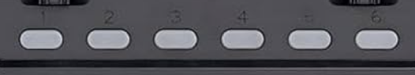

# README.md

## Prerequisites

- **Betaflight Configurator 10.10.0**


## Installation and Usage

1. **Install Betaflight Configurator:**

   [Betaflight Configurator 10.10.0](https://github.com/betaflight/betaflight-configurator/releases/tag/10.10.0)

***Example of VTX settings on RadioMaster BOXER RC:***




```bash
# vtx
vtx 4 7 0 1 0 975 1150
vtx 5 7 0 2 0 1150 1350
vtx 6 7 0 3 0 1350 1550
vtx 7 7 0 6 0 1550 1725
vtx 8 7 0 7 0 1725 1925
vtx 9 7 0 8 0 1925 2100
